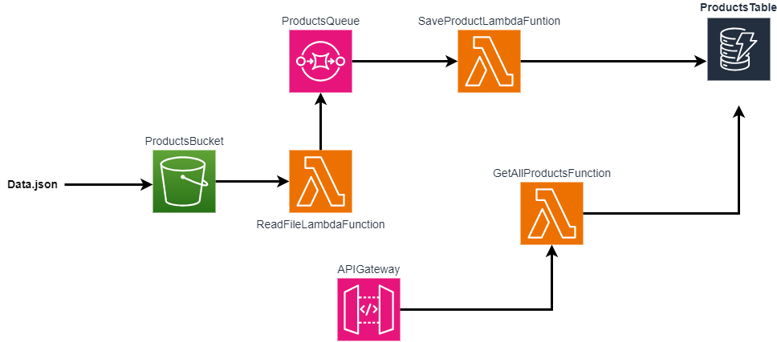

# Serverless Application

This project is a serverless application built with Java and Maven. It uses AWS Lambda functions to handle product data and store it in DynamoDB.

## Project Structure

- `template.yaml`: AWS CloudFormation template defining the Lambda functions and their ARNs.
- `src/main/java/com/mikayelovich/serverless_app/lambda/SaveProductLambda.java`: Lambda function to save product data in DynamoDB.
- `src/main/java/com/mikayelovich/serverless_app/lambda/GetAllProductsLambda.java`: Lambda function to retrieve all products from DynamoDB.
- `src/main/java/com/mikayelovich/serverless_app/lambda/ReadFileLambda.java`: Lambda function to read a file from S3 and push  its contents to SQS.
## Prerequisites

- Java 11 or higher
- Maven
- AWS CLI configured with appropriate permissions
- AWS SAM CLI

## Building the Project

To build the project, run the following command:

```sh
sam build
sam deploy --guided
```